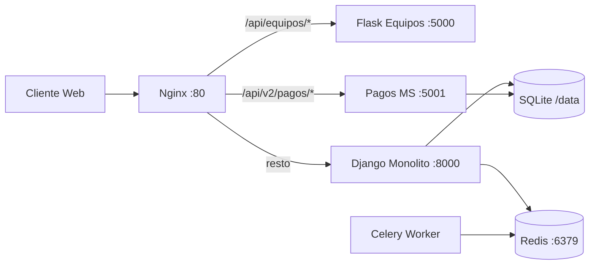

# TechRent — Plataforma de alquiler tecnológico

Sistema de alquiler de equipos tecnológicos con **arquitectura limpia** en Django, API REST (DRF), frontend SaaS integrado y despliegue **híbrido** (monolito + microservicios) detrás de **Nginx** como API Gateway.

## Características

| Área | Descripción |
|------|-------------|
| **Panel cliente** | Registro/login por sesión, catálogo por categorías, crear alquileres, mis alquileres y pagos |
| **Panel vendedor/admin** | Métricas, analytics (Chart.js), gestión de clientes/equipos/alquileres, vista DevOps (microservicios, Celery) |
| **API REST** | Endpoints versionados bajo `/api/v1/` con separación dominio → aplicación → infraestructura |
| **Strangler pattern** | Equipos vía Flask (`/api/equipos/`), pagos vía microservicio Flask (`/api/v2/pagos/`) |
| **Tareas asíncronas** | Celery + Redis para notificaciones y reportes |

## Arquitectura



### Capas (Clean Architecture)

| Capa | Carpeta | Responsabilidad |
|------|---------|-----------------|
| Dominio | `domain/` | Entidades, enums, builders (p. ej. `AlquilerBuilder`) |
| Aplicación | `application/` | Casos de uso, servicios, puertos (`interfaces/`) |
| Infraestructura | `infrastructure/` | Modelos ORM, repositorios Django, adaptadores, Celery |
| Presentación | `presentation/` | API DRF, vistas web, templates y estáticos del frontend |

Principios aplicados: **SRP**, **DIP** (puertos/adaptadores), alta cohesión y bajo acoplamiento entre negocio e infraestructura.

## Stack tecnológico

- **Backend:** Python 3, Django, Django REST Framework  
- **Microservicios:** Flask (equipos, pagos)  
- **Cola:** Redis, Celery  
- **Gateway:** Nginx  
- **Frontend:** HTML, Tailwind CSS, JavaScript (vanilla), Lucide Icons, Chart.js (panel admin)  
- **Contenedores:** Docker Compose  

## Inicio rápido (Docker)

### Requisitos

- Docker Desktop (o Docker Engine + Compose v2)
- Git

### Pasos

```bash
# 1. Clonar y entrar al proyecto
git clone https://github.com/Davidc17Q/Alquiler-Tecnologico.git
cd Alquiler-Tecnologico

# 2. Variables de entorno
cp .env.example .env
# Edita SECRET_KEY y, si aplica, credenciales de correo en .env

# 3. Levantar servicios
docker compose up --build -d

# 4. Migraciones y datos de prueba
docker compose exec django python manage.py migrate
docker compose exec django python manage.py seed_techrent --append
```

### Acceso

| Recurso | URL |
|---------|-----|
| **Aplicación web** | http://localhost |
| Django (directo) | http://localhost:8000 |
| Flask equipos | http://localhost:5000 |
| Pagos MS | http://localhost:5001 |
| Redis | localhost:6379 |

Abre **http://localhost** en el navegador. El login detecta el rol y muestra el panel de **cliente** o el de **vendedor/admin**.


### Autenticación

| Método | Ruta | Descripción |
|--------|------|-------------|
| POST | `/api/v1/auth/registro/` | Alta de cliente + sesión |
| POST | `/api/v1/auth/login/` | Login por email |
| POST | `/api/v1/auth/logout/` | Cerrar sesión |
| GET | `/api/v1/auth/me/` | Usuario actual y resumen |

### Cliente

| Método | Ruta | Descripción |
|--------|------|-------------|
| GET | `/api/v1/equipos/` | Catálogo de equipos |
| POST | `/api/v1/alquileres/` | Crear alquiler (requiere sesión) |
| GET | `/api/v1/mis-alquileres/` | Historial del usuario en sesión |

### Admin / vendedor (rol `VENDOR` o `ADMIN`)

| Método | Ruta | Descripción |
|--------|------|-------------|
| GET | `/api/v1/admin/dashboard/` | Métricas y sparklines |
| GET | `/api/v1/admin/analytics/` | Datos para gráficos |
| GET/PATCH | `/api/v1/admin/clientes/` | Listado y gestión de clientes |
| GET/POST/PATCH/DELETE | `/api/v1/admin/equipos/` | CRUD de equipos |
| GET | `/api/v1/admin/alquileres/` | Todos los alquileres |
| GET | `/api/v1/admin/infra/` | Health de servicios |
| GET | `/api/v1/admin/workers/` | Estado Celery/Redis (mock) |

### Gateway y microservicios (vía Nginx en `:80`)

| Ruta | Destino |
|------|---------|
| `/api/equipos/` | Microservicio Flask (equipos disponibles) |
| `/api/v2/pagos/` | Microservicio de pagos |
| `/api/info/`, `/api/precio-conversion/` | Monolito Django |

## Estructura del repositorio

```
├── application/          # Servicios y casos de uso
├── domain/               # Entidades y reglas de dominio
├── infrastructure/       # ORM, repositorios, adaptadores, migrations
├── presentation/
│   ├── api/              # DRF: auth, cliente, admin
│   ├── web/              # Vista principal (SPA-like)
│   ├── templates/        # base, cliente, admin_shell
│   └── static/           # CSS/JS (app.js, admin.js)
├── microservices/
│   └── pagos_service/    # MS pagos (Strangler)
├── flask_service/        # MS catálogo equipos
├── nginx/                # API Gateway
├── config/               # settings, urls, Celery
├── docker-compose.yml
└── manage.py
```

## Comandos útiles

```bash
# Ver logs
docker compose logs -f django

# Reiniciar tras cambios
docker compose up -d --build

# Shell Django
docker compose exec django python manage.py shell

# Tareas Celery (demo)
curl -X POST http://localhost/api/tareas/demo/ -H "Content-Type: application/json" -d "{}"
```

