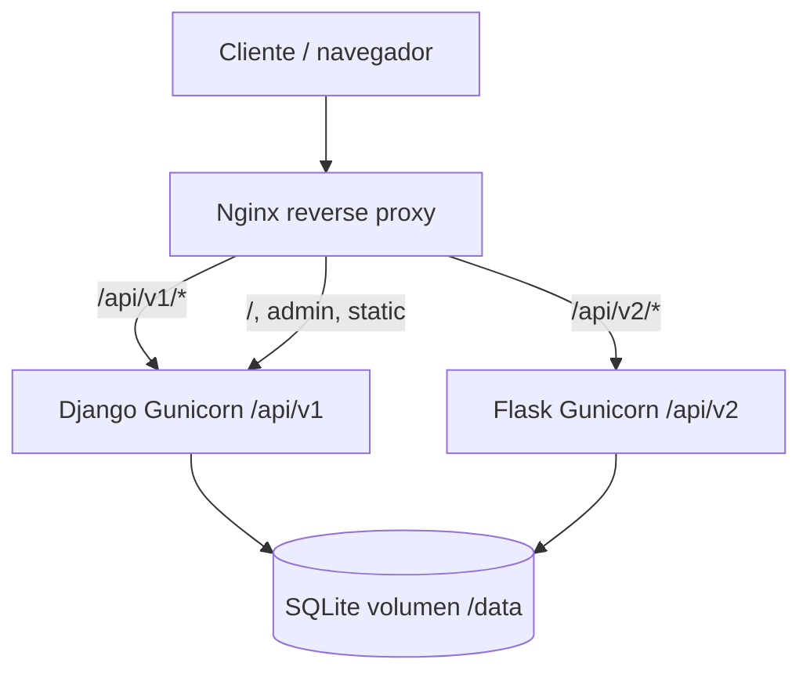

# Migración a Microservicios (Strangler Pattern)

Contenido listo para pegar en la Wiki del curso.

---

## 1. Módulo seleccionado

**Pagos (procesamiento de cobros y confirmación de alquileres)**

El endpoint público de creación de pagos dejó de exponerse en el monolito Django y quedó atendido por un microservicio independiente en **Flask**, enrutado por Nginx bajo **`/api/v2/pagos/`**. El resto de la API REST permanece en Django bajo **`/api/v1/`**.

---

## 2. Matriz de decisión

| Funcionalidad | Frecuencia de cambio | Consumo de recursos | Acoplamiento | Notas |
|---------------|----------------------|---------------------|--------------|--------|
| **Gestión de usuarios** (alta) | Media | Bajo | Bajo–medio | CRUD simple; poco beneficio al aislar primero. |
| **Catálogo de equipos** (listado) | Baja | Bajo | Bajo | Lectura estable; candidata fácil pero no prioritaria por impacto. |
| **Alquileres** (creación, reglas de fechas) | Media | Medio | Alto | Orquesta usuario/equipo y disponibilidad; mejor mantenerlo cohesivo en el núcleo al inicio. |
| **Pagos** (cobro + email + cambio de estado) | **Alta** (pasarelas, reglas de fraude, proveedores) | **Alto** (I/O red, SMTP, posible escalado horizontal) | **Alto** (pasarela, notificaciones, transición de estado del alquiler) | **Candidata principal** para strangler. |
| **Penalizaciones / notificaciones batch** | Media | Medio–alto (jobs, correos) | Medio | Hoy vive en comando de gestión; buen candidato futuro, no sustituye la criticidad del flujo de pago online. |

---

## 3. Justificación técnica (por qué “estangular” pagos)

1. **Frecuencia de cambio**: Las integraciones de pago y políticas comerciales suelen evolucionar con más rapidez que el catálogo o el CRUD de usuarios. Aislar pagos reduce el riesgo de regresiones en el resto del monolito.
2. **Consumo y escalado**: El cobro y el envío de notificaciones son operaciones dominadas por E/S y latencia de terceros; separarlas permite escalar u operar políticas (timeouts, circuit breakers) sin arrastrar todo Django.
3. **Acoplamiento**: `PagoService` concentra pasarela de pago, persistencia de `Pago`, actualización de estado del `Alquiler` y notificación al usuario: es un límite natural de negocio para un microservicio.
4. **Alineación con el patrón Strangler**: Las rutas nuevas (`/api/v2/...`) pueden convivir con las existentes (`/api/v1/...`) detrás de un reverse proxy, sin big-bang.

---

## 4. Arquitectura

- **Cliente / navegador**: consume la UI en Django y las APIs bajo el mismo origen (vía Nginx).
- **Nginx**: termina HTTP y enruta:
  - `/api/v1/` → **Django (Gunicorn)** — usuarios, equipos, alquileres.
  - `/api/v2/` → **Flask (Gunicorn)** — pagos; se reescribe el prefijo para que el servicio exponga rutas internas como `/pagos/`.
  - `/` (resto) → **Django** — plantillas y admin.
- **Persistencia**: SQLite compartida por volumen Docker (`SQLITE_PATH=/data/db.sqlite3`) para la entrega académica; en producción se sustituiría por un motor transaccional compartido o por sincronización vía eventos/API.
- **Microservicio Flask**: implementa la lógica de negocio del pago (validación, cobro simulado, transacción de escritura, email opcional por SMTP) sin depender del código del monolito.

---

## 5. Impacto esperado en el sistema

| Área | Impacto |
|------|---------|
| **Contratos de API** | Los clientes deben usar `/api/v1/...` para el núcleo y `/api/v2/pagos/` para pagos. |
| **Despliegue** | Docker Compose añade servicios `flask` y `nginx`; Django sigue siendo el dueño de migraciones y del esquema. |
| **Riesgo** | Mitigado: rutas versionadas y proxy explícito; el monolito conserva dominio y datos. |
| **Evolución futura** | Sustituir SQLite compartido por colas, sagas o API de compensación entre servicios. |

---

## 6. Diagrama (Mermaid)

---

## 7. Cómo probar (resumen)

1. `docker compose up --build`
2. Cargar datos: `docker compose exec django python manage.py seed_techrent`
3. Flujo: crear usuario → crear alquiler → **POST** `http://localhost:8080/api/v2/pagos/` con `alquiler_id`, `monto`, `metodo`.

---

## 8. Commits sugeridos (Convencional Commits)

- `feat(infra): add docker-compose, nginx and shared sqlite volume`
- `feat(api): version django rest under /api/v1 and remove pagos from monolith`
- `feat(pagos-ms): add flask payment microservice`
